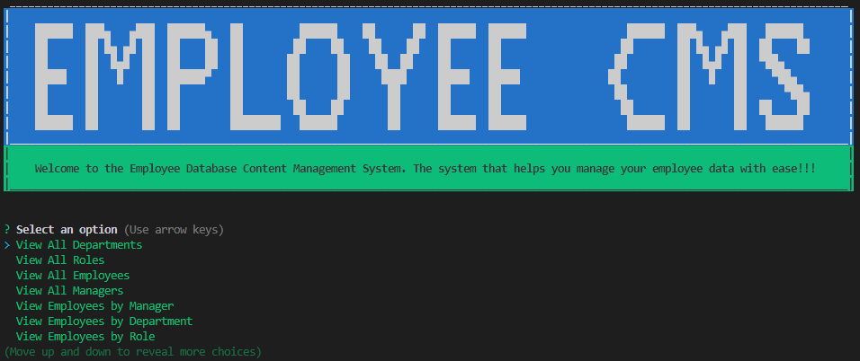

# Employee Database CMS
  

## Description

This is a content management system that allows a user to interact with an employee database. A user can manage departments, roles and employees. A user can easily display tables of important information. It also allows a user to update several fields of a record through proper prompts.

Click on the image to see a video demonstration!

## Table of Contents

- [Requirements](#requirements)
- [Installation](#installation)
- [Usage](#usage)
- [Contributing](#contributing)
- [Tests](#tests)
- [Questions](#questions)

## Requirements

This application requires the use of mysql. To personalize configuration modify the connection.js file in the config folder:

        host: 'localhost',
            // MySQL username,
        user: 'root',
            // TODO: Add MySQL password
        password: <ENTER PASSWORD>,
        database: 'employee_db'

## Installation

Use the following code in the command line to install the application:

    npm -i

A schema and seeds file is available to build the required tables and give starter data:

    source db/schema.sql
    source db/seeds.sql

## Usage

Use the following code in the command line to run the application:

    npm start

## Contributing

No contributions are allowed for this application

## Tests

There are no tests for this application

## Questions

GitHub Account:  [dmmerchant](https://github.com/dmmerchant)

Email Address: dmmerchant@gmail.com

